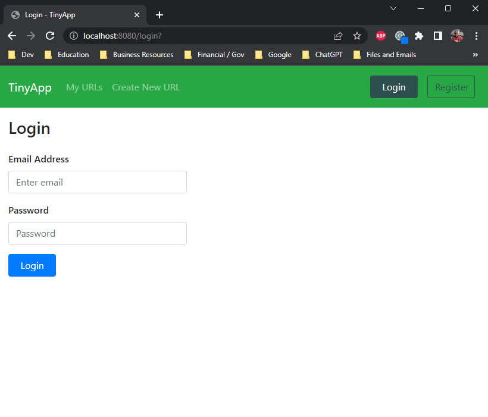
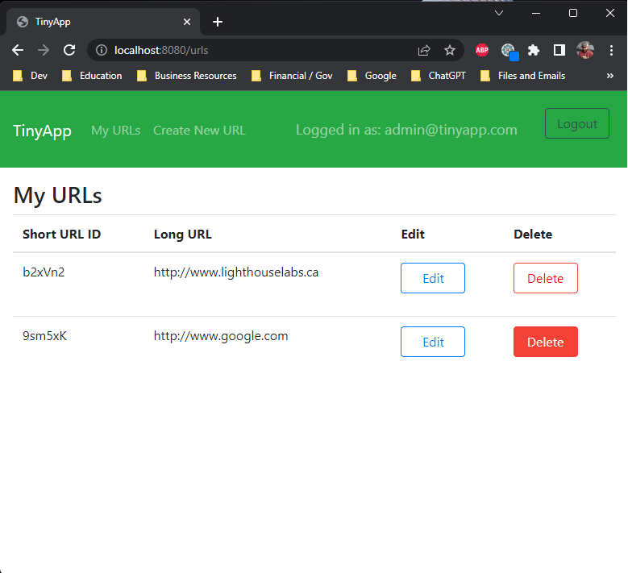
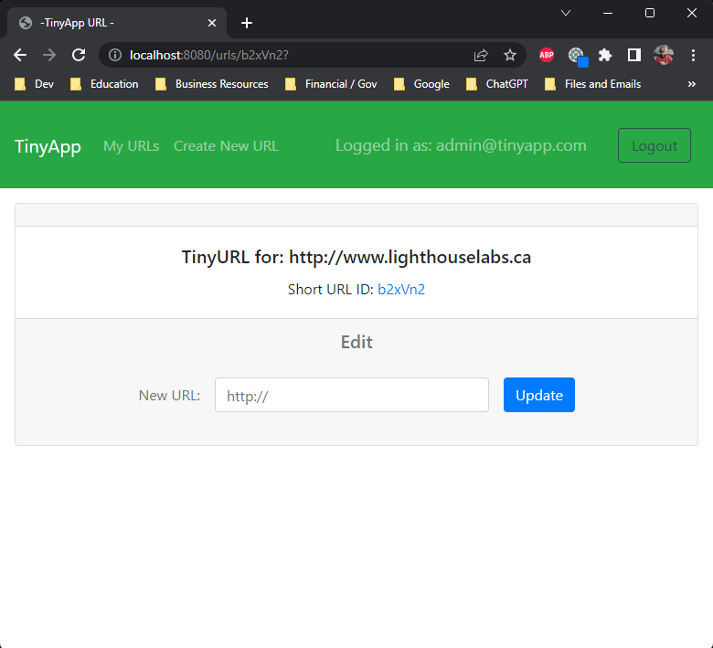
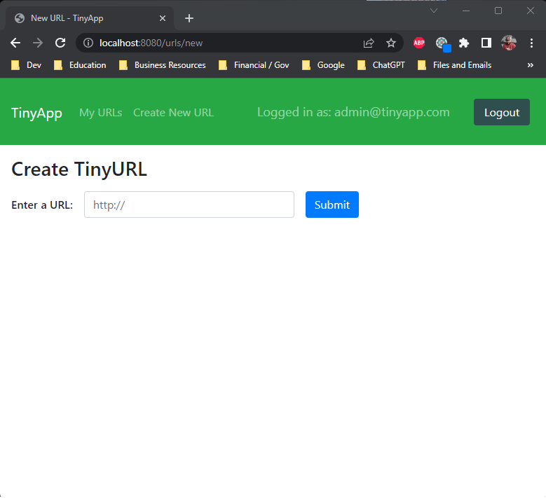
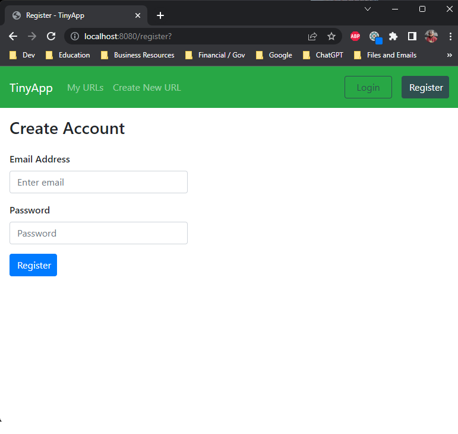

<br>


# 
<br>

## Overview

A four-day project involving the development of a multi-page, server-side rendering application that enables users to shorten long URLs, similar to services like TinyURL.com and bit.ly. 

This project has been completed by [Rishad Alam](https://github.com/rishadsanian) for the [Lighthouse Labs](https://www.lighthouselabs.ca/) Web Development Bootcamp.
<br>
<br>
## Table of Contents


- [Features](#features)
- [Images](#images)
- [Setup](#setup)
  - [Node](#node)
  - [Express Server](#express-server)
  - [Middleware](#middleware)
  - [Security and Authentication](#security-and-authentication)
  - [Helper Functions](#helper-functions)
  - [Functions Testing](#functions-testing)
  - [Styling](#styling)
- [Future Features](#future-features)


## Features
- Permits the user to create, read, update, and delete short-urls and their corresponding long-urls
- HTTP Server that handles requests from the browser (client)
- Authentication protection
- Reacts appropriately to the user's logged-in state
- Error handling features
<br>
<br>

## Images

 
 
 
 


<br>
<br>


## Setup

<br>

### Node
 ```console
 npm sart
 ```
 <br>
 
### Express Server
 
   - Basic Server Setup
   - Handle Endpoints, Routing, GETS, POSTS
   - Built-in encoder for parsing
<br>
<br>

### Middleware
  - Nodemon - Auto server restart for code changes and viewing console.logs
  - Morgan - For live monitoring of event status
  - EJS  - Viewengine used to generate dynamic views with capacity to manipulate data within html code
<br>
<br>

### Security and Authentication
- Bcrypt 
  -Used for generating salt used in hashing and in keys for cookie sessions
  -Used for hashing and validating passwords

- Cookie-session - Used to encrypt cookies
<br>
<br> 

### Helper Functions
  - ``` findUserByEmail ```: Checks if an email exists in the user database and returns the user id or null
  - ``` urlsForUser```: Returns the URLs for the specific logged in user
  - ```addHttpToURL```: Adds http:// to submitted links only if http:// or https:// is missing
  - ```generateRandomString```: function that generates random string that is 6 characters in length used for short urls and user ids

  - ```handleUnauthenticatedUser```,
  ```handleUnauthorizedAccess```,
  ```handleInvalidUrl```,
  ```handleInvalidCredentials``` : Error code handler functions to handle various status codes
<br>
<br>

### Functions Testing
- Mocha and Chai  - assert.deepStrictEqual is used to compare functions that return objects
<br>
<br>

### Styling - EJS | HTML | CSS
- Views and partials made with ejs files
-  Basic css styling provided using bootstrap 
- Created buttons, forms and additonal elements with custom css styling to keep it consistent with existing style attributes
<br>
<br>

## Future Features
- Analytics on number of visits and unique visits on short URL
- Date of short url creation
- Database integration
- Error view page with dynamic messaging based on error code/handler
- Copy shorturl button from urlshow/urls index page